# GRPO训练流程代码执行图

当你执行 `bash examples/grpo_trainer/run_qwen3-8b.sh` 时，代码的执行流程如下：

## 主要执行流程

```mermaid
graph TD
    A["bash examples/grpo_trainer/run_qwen3-8b.sh"] --> B["设置环境变量 set -x"]
    B --> C["调用 Python 主程序<br/>python3 -m verl.trainer.main_ppo"]
    C --> D["Hydra 配置管理<br/>@hydra.main 装饰器"]
    D --> E["解析命令行参数<br/>algorithm.adv_estimator=grpo<br/>data.train_files=...<br/>actor_rollout_ref.model.path=Qwen/Qwen3-8B<br/>等40+个参数"]
    E --> F["调用 run_ppo(config)"]
    
    F --> G["初始化 Ray 集群<br/>ray.init()"]
    G --> H["创建 TaskRunner 远程实例<br/>TaskRunner.remote()"]
    H --> I["执行 TaskRunner.run(config)"]
    
    I --> J["配置验证和解析<br/>OmegaConf.resolve(config)"]
    J --> K["添加 Actor-Rollout Worker<br/>add_actor_rollout_worker()"]
    K --> L["添加 Critic Worker<br/>add_critic_worker()"]
    L --> M["添加 Reward Model Worker<br/>add_reward_model_worker()"]
    M --> N["添加 Reference Policy Worker<br/>add_ref_policy_worker()"]
    
    N --> O["下载模型检查点<br/>copy_to_local()"]
    O --> P["初始化 Tokenizer 和 Processor<br/>hf_tokenizer(), hf_processor()"]
    P --> Q["加载奖励管理器<br/>load_reward_manager()"]
    Q --> R["初始化资源池管理器<br/>init_resource_pool_mgr()"]
    
    R --> S["创建训练和验证数据集<br/>create_rl_dataset()"]
    S --> T["创建数据采样器<br/>create_rl_sampler()"]
    T --> U["初始化 RayPPOTrainer<br/>RayPPOTrainer()"]
    U --> V["初始化 Workers<br/>trainer.init_workers()"]
    V --> W["开始训练循环<br/>trainer.fit()"]
    
    W --> X["加载检查点<br/>_load_checkpoint()"]
    X --> Y["预训练验证<br/>_validate()"]
    Y --> Z["开始训练循环<br/>for epoch in range(total_epochs)"]
    
    Z --> AA["数据批次处理<br/>for batch_dict in train_dataloader"]
    AA --> BB["生成序列<br/>actor_rollout_wg.generate_sequences()"]
    BB --> CC["计算奖励<br/>reward_fn(batch)"]
    CC --> DD["计算旧对数概率<br/>actor_rollout_wg.compute_log_prob()"]
    DD --> EE["计算参考策略对数概率<br/>ref_policy_wg.compute_ref_log_prob()"]
    EE --> FF["计算价值函数<br/>critic_wg.compute_values()"]
    
    FF --> GG["GRPO 优势计算<br/>compute_grpo_outcome_advantage()"]
    GG --> HH["计算优势统计<br/>- 按 prompt 分组<br/>- 计算均值和标准差<br/>- 标准化优势值"]
    HH --> II["PPO 策略更新<br/>actor_rollout_wg.update()"]
    II --> JJ["Critic 更新<br/>critic_wg.update()"]
    
    JJ --> KK["记录指标和日志<br/>logger.log()"]
    KK --> LL{"是否达到总步数?"}
    LL -->|否| AA
    LL -->|是| MM["保存最终模型<br/>save_checkpoint()"]
    MM --> NN["训练完成"]
    
    style A fill:#e1f5fe
    style C fill:#f3e5f5
    style G fill:#fff3e0
    style W fill:#e8f5e8
    style GG fill:#ffebee
    style NN fill:#e8f5e8
```

## 详细说明

### 1. 脚本启动阶段
- **脚本执行**: `run_qwen3-8b.sh` 设置调试模式并调用Python主程序
- **参数配置**: 通过命令行传递40+个配置参数，包括：
  - 算法类型: `algorithm.adv_estimator=grpo`
  - 数据路径: GSM8K训练和测试数据
  - 模型路径: `Qwen/Qwen3-8B`
  - 训练参数: 批次大小、学习率、GPU配置等

### 2. 系统初始化阶段
- **Ray集群**: 初始化分布式计算框架
- **Worker注册**: 注册不同类型的Worker（Actor、Critic、Reward Model、Reference Policy）
- **资源管理**: 配置GPU资源池和分配策略

### 3. 模型和数据准备阶段
- **模型下载**: 从远程下载Qwen3-8B模型检查点
- **Tokenizer初始化**: 加载分词器和处理器
- **数据集创建**: 创建GSM8K训练和验证数据集
- **奖励函数**: 加载奖励模型用于评估生成质量

### 4. 训练循环核心阶段
每个训练步骤包含以下关键操作：

#### 4.1 序列生成
- 使用Actor模型生成多个候选回答（n=5）
- 支持异步生成模式提高效率

#### 4.2 奖励计算
- 使用奖励模型评估生成质量
- 支持多种奖励类型（规则基础、模型基础）

#### 4.3 GRPO优势计算
- **分组计算**: 按prompt ID对生成的回答进行分组
- **统计计算**: 计算每组回答的均值和标准差
- **优势标准化**: 使用 `(score - mean) / (std + epsilon)` 进行标准化
- **掩码应用**: 只对有效token计算优势

#### 4.4 策略更新
- **PPO更新**: 使用计算的优势更新Actor策略
- **Critic更新**: 更新价值函数估计
- **KL散度控制**: 防止策略偏离参考模型太远

### 5. 监控和保存
- **指标记录**: 记录训练指标到WandB和Console
- **定期验证**: 每5步进行一次验证
- **模型保存**: 每20步保存一次检查点

## GRPO算法特点

GRPO (Group Relative Policy Optimization) 是一种改进的PPO算法：

1. **分组优势计算**: 对同一prompt的多个回答进行分组，计算相对优势
2. **标准化处理**: 通过标准差标准化优势值，提高训练稳定性
3. **多候选生成**: 每个prompt生成多个候选回答（n=5）用于优势估计
4. **KL散度控制**: 使用KL损失而非KL奖励惩罚，更稳定

这个流程展示了现代强化学习训练系统的复杂性，涉及分布式计算、模型并行、数据流水线等多个技术组件。